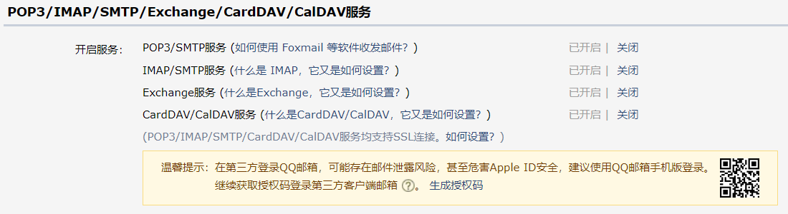
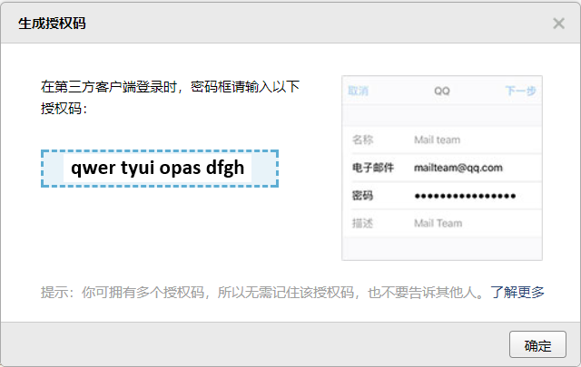

Kindle 分享至饭否
===================

这是 `Kindle饭 <https://m.setq.me/apps/kindle>`_ 的源码，简单修改即可搭建属于自己的服务。

如果你只是想使用而不是搭建它，请访问 `Kindle饭 - 使用帮助 <https://m.setq.me/apps/kindle/help>`_ 。

测试环境
------------

在 Archlinx 和 Windows 10 中，Python 2.7 测试通过。

安装依赖
------------

.. code-block:: bash

   pip install fanfou

修改配置
------------

你需要修改 kindle.py 中的 server、user、pass_、consumer、username 和 password 。

其中 server 为邮箱的 pop 服务地址，user 为你的邮箱地址，pass_ 为授权码。以 QQ 邮箱为例，授权码可在 设置-账户 中获得，如下图所示：

注意输入授权码时不需要包括空格。

consumer 可在 `饭否开发平台 <https://fanfou.com/apps>`_ 申请，username 和 password 分别为你的饭否用户名和密码。其他的认证方式可参考 `fanfou-py <https://github.com/akgnah/fanfou-py>`_ 文档。

运行
-------

.. code-block:: bash

   python2 kindle.py

你可以使用 Crontab 来让它定时执行。

致谢
------

感谢阅读，如有疑问请联系我 `@home2 <https://fanfou.com/home2>`_ 。
